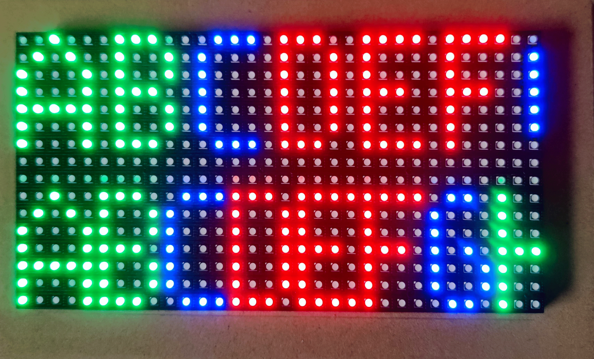
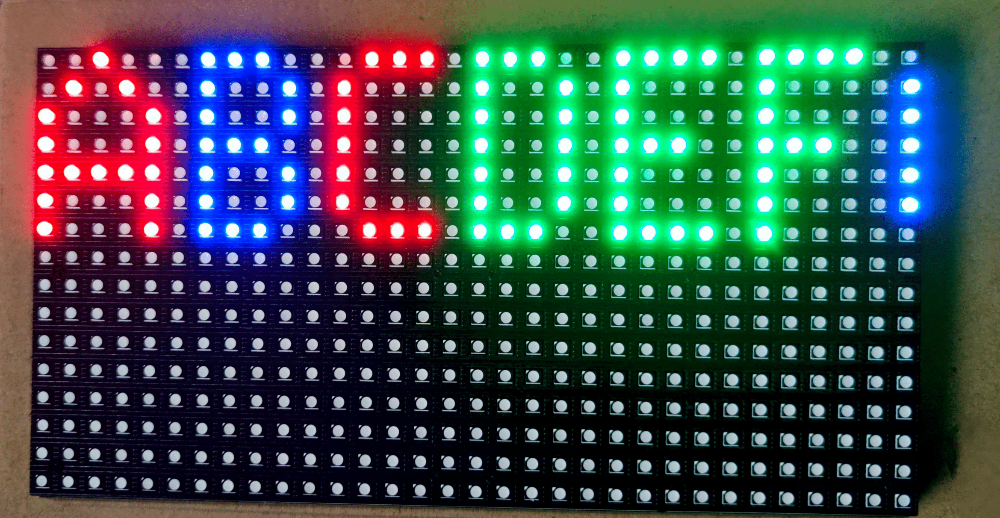

#IDP-LabSessions
- [IIW KU LEUVEN](https://iiw.kuleuven.be/)
- [Teacher: Stijn Volckaert](https://github.com/stijn-volckaert)
- [Course: Veilige Software](https://onderwijsaanbod.kuleuven.be//2020/syllabi/n/JPI12LN.htm#activetab=doelstellingen_idp4512256)
- Subject: Project

See [assignement](assignement.md) for more info.


# Adafruit LED matrix driver in rust
```Image``` -> ```Vec<Frame> ``` --> ```RGB Matrix```
# Table of contents 
1. [Effects](#I)
2. [Authors](#II)
3. [Links](#III)




## 1. Effects                             <a name="I"></a>
### 1.A Possibles Modes
- [x] Show a picture ```arg[1]=<picture>.ppm``` (lab 3)
- [x] Show a text ```arg[1]=<text>.txt``` (killer feature)
### 1.B Possibles Effects 
(pass to arg[x] after passing mode arguments)
#### Color Effects
- [x] ``` --colors=grey ```
- [x] ``` --colors=invert ```
- [x] ``` --colors=gamma ```
#### Mirror Effects
- [x] ``` --mirror=vertical```
- [x] ``` --mirror=horizontal ```
#### Other Effects
- [x] ``` --scroll ```
### 1.C NEWS API
- [x] ```cd text; python3 Main.py; cd ..; sudo cargo run text/LatestNews.txt --scroll ```

## 2. Authors                              <a name="II"></a>
- [Nick Braeckman](https://github.com/NickBraeckman)
- [Cedric Lefevre](https://github.com/Cedric-Lefevre)
- [Romeo Permentier](https://github.com/ro-per)


## 3. Links                               <a name="III"></a>
- [Working Repository](https://github.com/ro-per/VS-Project-LED-Matrix)
- [Publish Repository](https://github.com/ku-leuven-msec/veiligesoftware-20202021-groep1)
- [C++ Library](https://github.com/hzeller/rpi-rgb-led-matrix) for driving RGB-Matrix
- [Lab 1: Debugging C and CPP with GDB](https://github.com/ro-per/VS-Lab1_Debugging_C_CPP_with_GDB)
- [Lab 2: Memory Exploits in C](https://github.com/ro-per/VS-Lab2_Memory_Exploits_in_C)
- [Lab 3: IO and parsing in Rust](https://github.com/ro-per/VS-Lab3_IO_and_Parsing_in_Rust/blob/main/src/main.rs)
- [Lab 4: LED matrix driver](https://github.com/ro-per/VS-Lab4-LED_Matrix_Driver_in_Rust)
